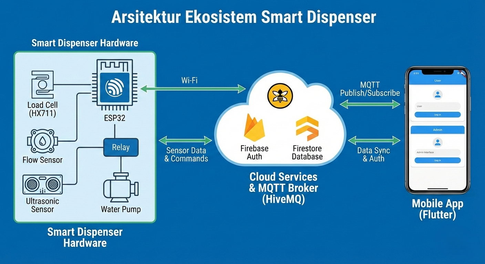
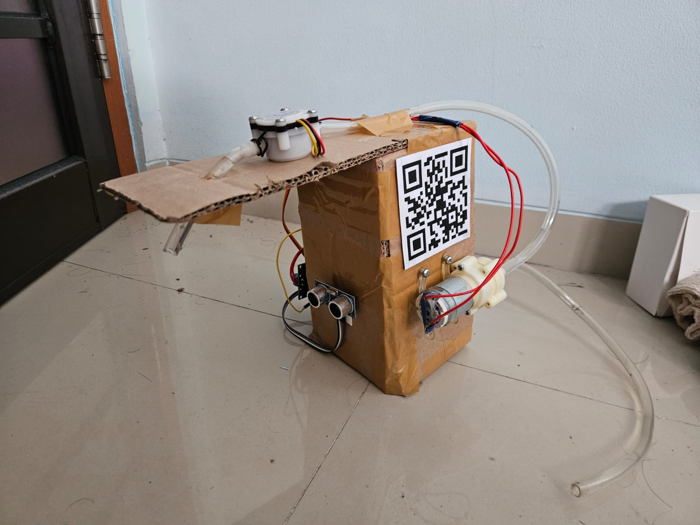
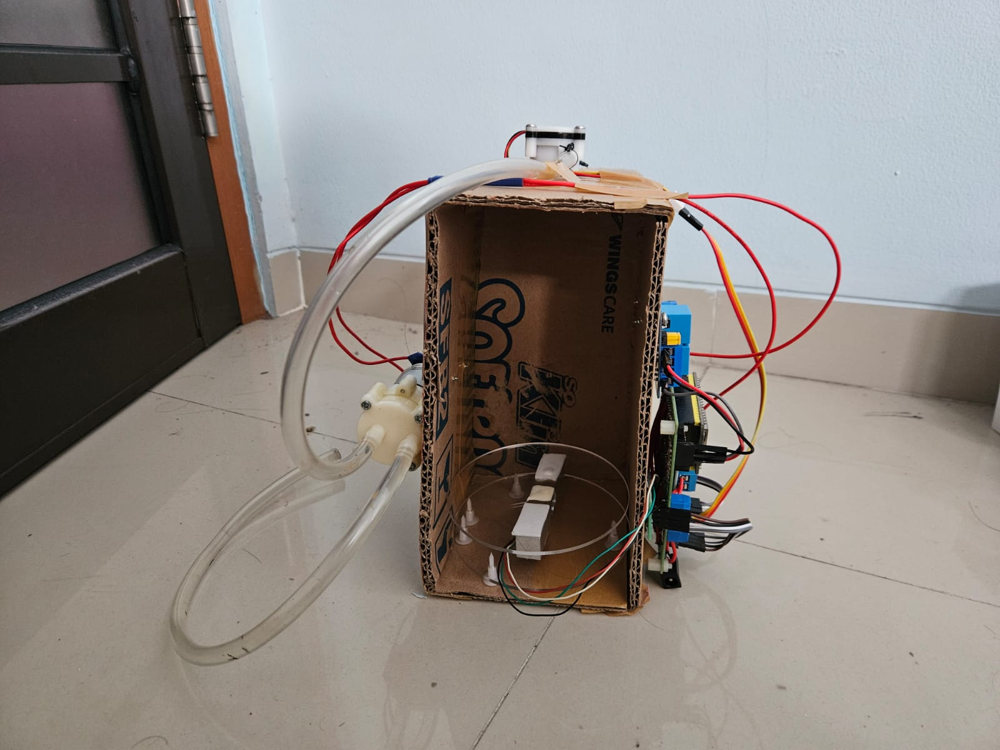
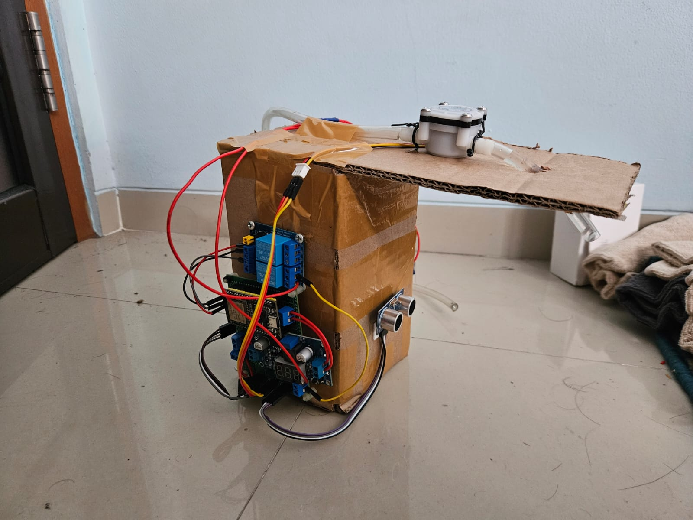

# 🚰 Smart Dispenser IoT System

A smart drinking water distribution system integrating **Internet of Things (IoT)** for precise water consumption management, real-time stock monitoring, and operational efficiency.

## 📖 Overview

The Smart Dispenser project addresses water wastage and manual monitoring issues found in conventional dispensers. This system allows users to dispense water with precise volume control (in milliliters) via a mobile app, tracks daily usage quotas, and provides real-time gallon stock data to administrators.

### Key Features
- **Precision Pouring:** Automatic filling based on user input volume (ml).
- **Real-time Monitoring:** Accurate water level tracking using a Load Cell weight sensor.
- **Safety Interlock:** Instant emergency stop (< 0.1s) if the cup is removed during filling.
- **Quota Management:** Daily water consumption limit per user.
- **Smart Reporting:** Automatic cloud synchronization for transaction logs and low-stock alerts.

---

## 🏗️ Ecosystem Architecture

The system utilizes a *bi-directional communication* architecture between the Hardware, Cloud, and Mobile App.

### Data Flow
1. **Mobile App** sends a `START` command via MQTT.
2. **ESP32** processes the command, activates the pump, and calculates water flow.
3. **ESP32** sends a `REPORT` (Success/Aborted) and sensor data back to the App.
4. **Firebase** logs the transaction history and synchronizes user quotas.

---

## 🛠️ Technical Documentation

### Hardware (Edge Layer)
* **Microcontroller:** ESP32 Dev Module (Wi-Fi enabled).
* **Weight Sensor:** Load Cell 20kg + HX711 Amplifier (Updates every 5s).
* **Flow Sensor:** Water Flow Sensor YF-S201 (measures dispensing volume).
* **Safety Sensor:** Ultrasonic HC-SR04 (Safety threshold: < 25cm).
* **Actuators:** 5V Relay & DC Water Pump.

### Wiring Diagram
| Component | GPIO Pin | Description |
| :--- | :--- | :--- |
| **Relay** | GPIO 13 | Water pump control |
| **Servo** | GPIO 12 | Valve position control (PWM) |
| **Flow Sensor** | GPIO 14 | Pulse input for volume measurement |
| **Ultrasonic (Trig)**| GPIO 5 | Triggering ultrasonic pulse |
| **Ultrasonic (Echo)**| GPIO 18 | Receiving ultrasonic echo pulse |
| **HX711 (DT)** | GPIO 19 | Data line for weight sensor |
| **HX711 (SCK)** | GPIO 21 | Clock line for weight sensor |
| **ESP32 TX** | RX | Serial communication |
| **ESP32 RX** | TX | Serial communication |

### Software (Application Layer)
* **Mobile App:** Flutter (Dart).
* **Backend:** Firebase Authentication & Cloud Firestore.
* **Communication:** MQTT (HiveMQ Broker) via TCP/IP port 8883 (SSL).
* **Firmware Logic:** C++ (Arduino Framework).

---

## 🔄 Business Logic & Workflow

1. **Authentication:** User scans the QR Code on the dispenser to connect.
2. **Request:** User inputs the desired amount (e.g., 200ml). System validates the daily quota.
3. **Filling Process:**
   - ESP32 activates the pump.
   - Ultrasonic sensor monitors cup presence every 100ms.
   - If the cup is lifted, the pump stops immediately (Safety Stop).
4. **Settlement:**
   - User quota is deducted based on the **actual** volume dispensed (Flow Sensor data).
   - Gallon stock in the database is updated based on flow reduction to ensure data stability.
   - The weight sensor re-calibrates the absolute water level only when the dispenser is idle.

---

## ⚙️ Implementation & Setup

### Firmware Installation
1. Open the `firmware/` folder using Arduino IDE or PlatformIO.
2. Install required libraries: `PubSubClient`, `HX711`, `NewPing`, `ArduinoJson`.
3. Configure Wi-Fi credentials and MQTT Broker details in `config.h` (or main file).
4. Flash the code to the ESP32.

### Mobile App Installation
1. Open the `mobile-app/` folder in VS Code or Android Studio.
2. Run `flutter pub get` to install dependencies.
3. **Important:** Ensure your `google-services.json` is placed in `android/app/`.
4. Run the app: `flutter run`.

### Calibration
* **Load Cell:** Adjust the `weightCalibrationFactor` in the firmware code. Increase/decrease the value to match the physical weight reading.
* **Flow Sensor:** Calibrate the pulse frequency factor if the dispensed volume is inaccurate.

---

## Documentation

  
  
   

https://github.com/user-attachments/assets/a8b61bfb-6b1a-4739-b7d7-815ade026072

---
